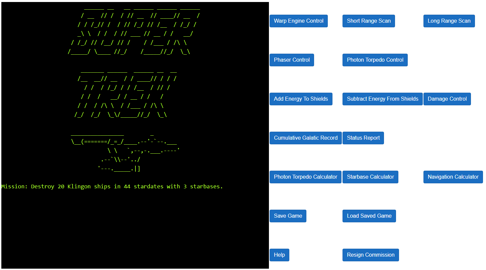
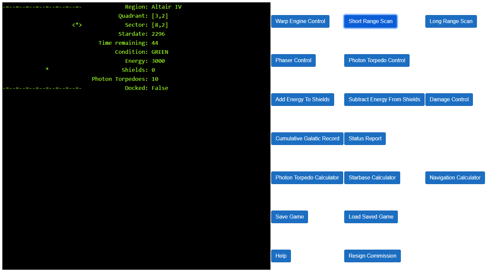
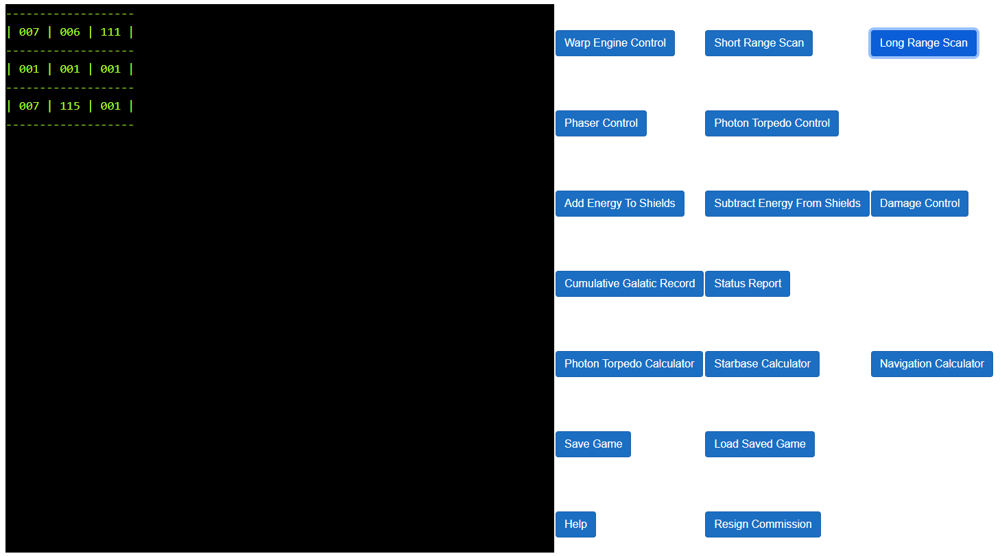
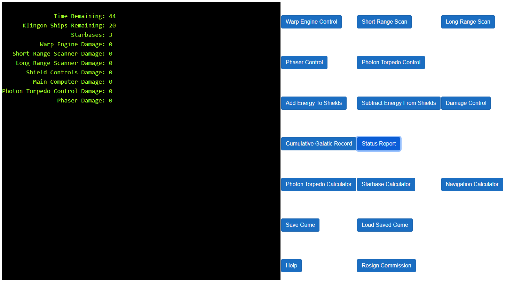

# Trek.Net
_Trek.Net_ is a faithful recreation of the classic, text mode, space exploration and combat game.
Go around the universe at warp speed, battle enemies and dock at starbases for repairs.
You can't afford to hang around as the enemy is everywhere and there is only a limited amount
of time.

_Trek.Net_ features:
  * same classic game engine underneath
  * retro green screen look
  * streamlined and modern interface
  * easy access to all commands
  * load and save games
  * runs in the browser with webassembly!

